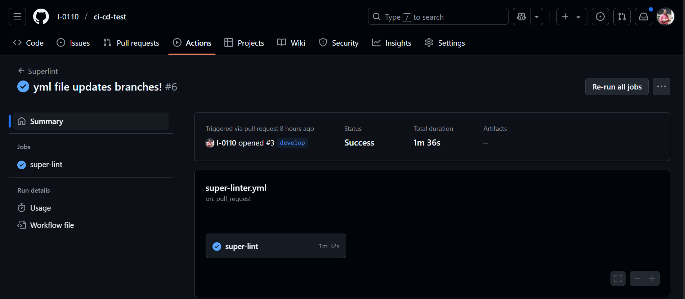

# CI-CD

## Description

Our CI-CD is inspired by developers who want to save time and money running quality checks prior merging to main or any other important branch. We created this project because we want to familiarize with Continuous Integration and Continuous Deployment that are  common practices in nowaday development. We resolved the hours running local tests and the consistency of running a test everytime we push a request to main branch. We learned that GitHub Actions is very reliable on running tests consistently and pointing out where we can have conflicts before merge with the main branch.

## Table of Contents

- [Installation](#installation)
- [Usage](#usage)
- [Credits](#credits)
- [License](#license)

## Installation

Steps for installation:
Step 1: Go to https://ci-cd-test-ov0k.onrender.com/ or https://github.com/I-0110/ci-cd-test
Step 2: If access on github, notice the page with the repo's creator and repo title. Look at the button "main", then the repo's creator name down with the most recent pull request.
Step 3: If you notice a blue check mark it means that it passed all the tests. You can also go to Actions and see all the tests that has been run

## Usage

You can use our CI-CD by accesing GitHub Actions section or looking directly at .githib/workflows/super-lint.yml to get ideas of how to build your own.

    
    
## Credits

- Collaborator(s):
Ivelis Becker (https://www.github.com/I-0110)

## Features

CI/CD tests with Cypress and GitHub Actions

## How to Contribute

Please email me at ivelisbecker@gmail.com to share ideas of how to contribute

## Tests

Created by Ivelis Becker GitHub: I-0110

## Questions 

For questions, please contact Ivelis Becker, ivelisbecker@gmail.com, https://github.com/I-0110
